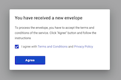
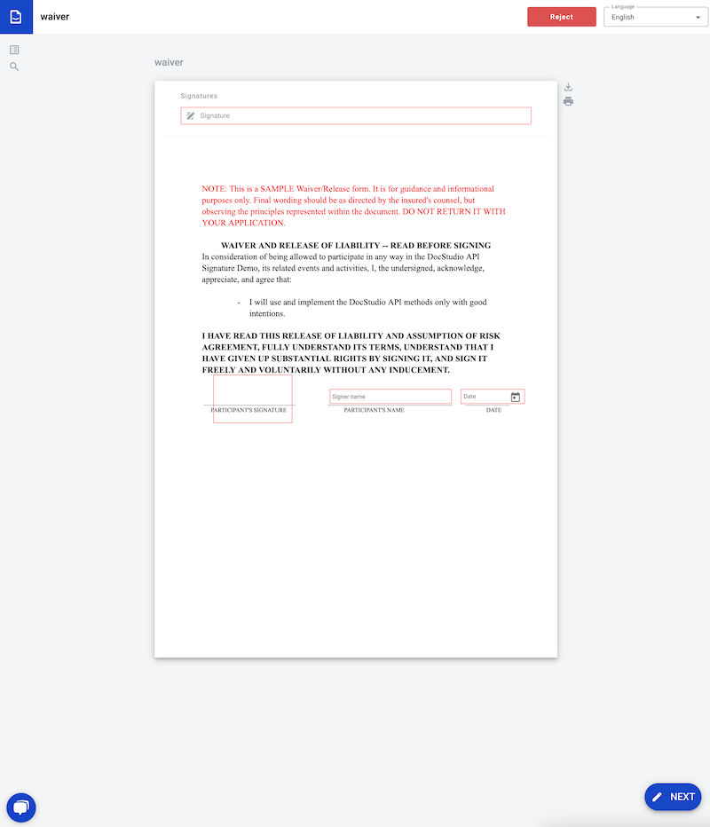
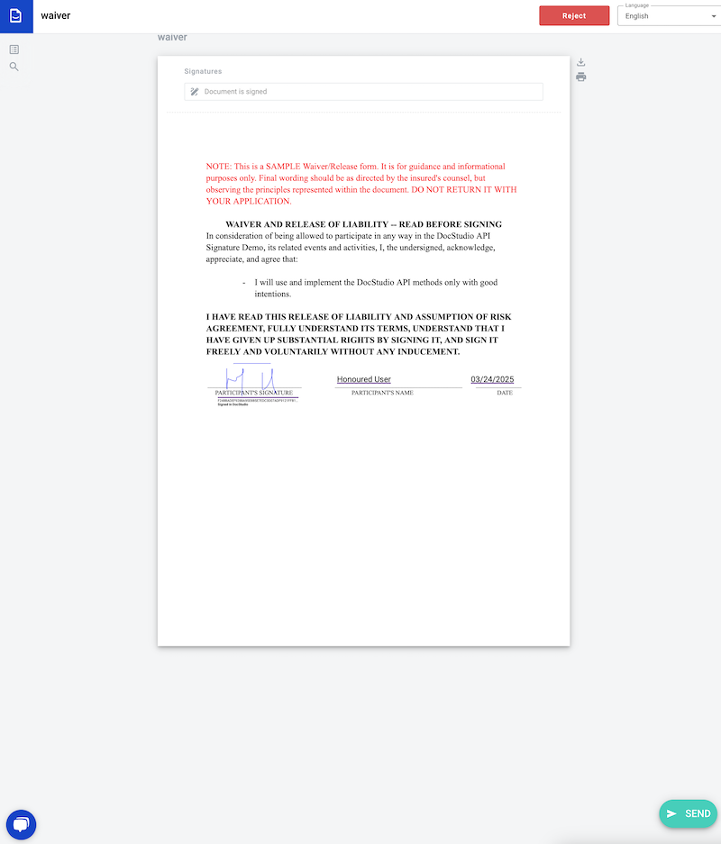
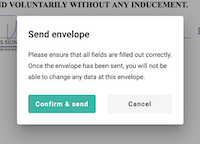

# How to Collect E-Signature and Other Data on Your PDF Using DocStudio API

In the world of digital business, signatures are more than just a formality — they’re a critical part of trust,
compliance, and workflow automation. Whether you’re closing deals, onboarding clients, or approving internal documents,
the ability to collect legally binding electronic signatures quickly and securely can make or break your process.

That’s where DocStudio comes in.

DocStudio is a modern, enterprise-grade EDI (Electronic Data Interchange) platform that goes far beyond document storage
and exchange. It offers a rich, flexible, and developer-friendly API that allows you to integrate complex document
workflows — including electronic signature collection — directly into your application or service.

In this tutorial, we’ll walk through how to use the DocStudio API to collect a signature on a PDF document. Whether
you're building an internal tool or a customer-facing app, this guide will show you how to:

- Upload a PDF document to DocStudio
- Define signers and signature fields
- Trigger signature requests
- Download the signed document

By the end of this guide, you’ll have a working signature flow fully integrated into your system — no manual steps, no
external signing platforms, no friction.

Let’s dive in.

### 1. Registration

First we need to create an account on DocStudio. You can do this by visiting
the [DocStudio registration page](https://app.docstudio.com/auth/registration) and following the instructions.


### 2. Obtaining application token

Once you have an account, you’ll need to get an application token. To do this you need to log in to
the [DocStudio](https://app.docstudio.com/), proceed
to [Application token tab at Profile page](https://app.docstudio.com/profile?activeTab=application-tokens) and generate
a new token. Keep it in safe place and never use in public repositories or share it with anybody. This token gives you
full access to the DocStudio API and should be treated as a secret.


### 3. Prepare your PDF document

For this demo I've prepared simple waiver form in PDF format. You can download it [here](./files/waiver.pdf).

### 4. Add required dependency (DocStudio API client)

Create new Java project or use existing one and
add [DocStudio API client](https://github.com/jecksolovyev/com.docstudio.api.client) dependency.

To use it in your Maven build add:

```xml

<repositories>
    <repository>
        <id>jitpack.io</id>
        <url>https://jitpack.io</url>
    </repository>
</repositories>
        ...
<dependency>
    <groupId>com.github.jecksolovyev</groupId>
    <artifactId>com.docstudio.api.client</artifactId>
    <version>R127.4</version>
</dependency>
```

To use it in with Gradle add:

```groovy
repositories {
    ...
    maven { url "https://jitpack.io" }
}
...
dependencies {
    implementation 'com.github.jecksolovyev:com.docstudio.api.client:R127.4'
    ...
}
```

### 5. Use DocStudio API client to interact with DocStudio API
5.1. Create a new instance of `ApiClient` class and pass your application token to it:
```java
import com.docstudio.client.ApiClient;
...

private ApiClient getApiClient(String token) {
    ApiClient client = new ApiClient();
    client.setBearerToken(token);
    return client;
}

...

ApiClient client = getApiClient("my_application_token");
```
5.2. Get first user mailbox ID:
```java
MailboxControllerApi mailboxControllerApi = new MailboxControllerApi(apiClient);
UUID mailboxId = mailboxControllerApi.getAllForUser().getFirst().getMailboxUuid();
```

5.3. Upload your PDF document to DocStudio:
```java
TemplateControllerApi templateControllerApi = new TemplateControllerApi(apiClient);
File waiver = new File("./files/waiver.pdf");
UploadedPdfDTO uploadResult = templateControllerApi.uploadPdf(mailboxId, waiver, "DELETE", true); //Delete all pdf fields, if any
```
> Please also check our [Service documentation](https://docs.docstudio.com/) and [Swagger](https://api.docstudio.com/swagger-ui/index.html) for more details.

5.4. Prepare template XML
```java
        String pdfHash = uploadResult.getHash(); //d176b8d3750dcd95e242253957956c0e2f56a77ba2987d5c7cacb6d6f0b6bc0b
        String pdfId = uploadResult.getUuid().toString(); //f9c8045b-d1b7-46c0-a93e-3f3cbfbb032d
        // Use pdfHash and pdfId for template XML
        String template = """
        <template>
        	<info>
        		<name>Waiver Signature request</name>
        		<description>One-time send envelope template</description>
        		<subject>Waiver Signature request for a most honoured user</subject>
        		<forwarding copy="false" delegation="true" sharing="true"/>
        	</info>
        	<documents>
        		<document id="waiver-doc" landscape="false" pageSize="letter" type="pdf">
        			<info>
        				<title>Waiver</title>
        				<pdf hash="%pdfhash%" uuid="%pdfid%"/>
        			</info>
        			<body>
                        <field name="Signature" page="0" roleId="user-signs" type="einksign" width="42.33" x="31.49" y="125.94"/>
                        <field height="7.94" name="Date" page="0" roleId="user-signs" type="datetime" width="34.4" x="164.04" y="136.26"/>
                        <field height="7.94" name="Signer name" page="0" roleId="user-signs" type="text" width="65.35" x="93.9271" y="136.2604"/>
        			</body>
        		</document>
        	</documents>
        	<flow type="auto">
        		<roles>
        			<role id="i-send" order="0" title="Sender" type="sender"/>
        			<role id="user-signs" order="1" title="Honoured" type="assignee"/>
        		</roles>
        	</flow>
        </template>
        """.replace("%pdfhash%", pdfHash).replace("%pdfid%", pdfId);
```
5.5. Prepare envelope XML
```java
    //Use mailboxId from previous step - 0243d4c8-1462-4389-a868-56e44f9abcb7
    String envelope = """
    <envelope>
        <info>
            <subject>Waiver signature</subject>
            <message/>
            <forwarding delegation="true" sharing="true"/>
        </info>
        <flow>
            <roles>
                <role id="i-send" mailboxUuid="0243d4c8-1462-4389-a868-56e44f9abcb7"/>
                <role id="user-signs" mailboxUuid="honoured.user@domain.com"/>
            </roles>
        </flow>
    </envelope>
    """;
```
5.6. Send envelope
```java
    EnvelopeControllerApi envelopeControllerApi = new EnvelopeControllerApi(apiClient);
    OneTimeSendDTO request = new OneTimeSendDTO();
    request.setEnvelopeXml(envelope);
    request.setTemplateXml(template);
    UUID sentEnvelopeId = envelopeControllerApi.oneTimeSend(mailboxUuid, request).getUuid();
```

> The envelope is sent to the email you have put in the envelope XML. The signer will receive an email with a link to the document and will be able to sign it.









5.7. After envelope was signed you can download the signed document:
```java
if (envelopeControllerApi.getEnvelopeByUuid(sentEnvelopeId, mailboxId).getEnvelope().getStatus().equals(EnvGetDTO.StatusEnum.COMPLETED)) {
    File envelopeZip = envelopeControllerApi.getEnvelopeZip(sentEnvelopeId, mailboxUuid, null, null, null);
    //unzip archive and get everything you need
}
```

### 6. Conclusion
As you've seen, integrating electronic signature functionality into your application using the DocStudio API is not only possible — it's straightforward, powerful, and highly customizable. From uploading a PDF to defining interactive fields, sending signature requests, and finally downloading the signed document, DocStudio gives you full control over the entire process through a clean and developer-friendly API.

Whether you're automating legal agreements, HR documents, waivers, or any other signature-driven workflow, DocStudio lets you embed that functionality directly into your product without relying on third-party signing platforms or clunky manual processes.

This tutorial covered the basics of a one-time signature flow, but DocStudio supports much more: reusable templates, embedded signing, complex role-based workflows, webhooks, and detailed audit trails — all accessible via the same consistent API.

Now that you've seen what's possible, imagine how much of your document pipeline you can automate.

Happy coding!