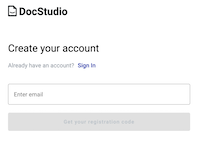
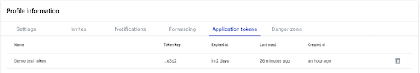
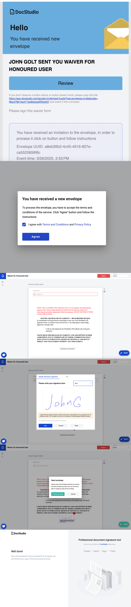

# How to collect a signature on your PDF using DocStudio API

In the world of digital business, signatures are more than just a formality — they’re a critical part of trust,
compliance, and workflow automation. Whether you’re closing deals, onboarding clients, or approving internal documents,
the ability to collect legally binding electronic signatures quickly and securely can make or break your process.

That’s where DocStudio comes in.

DocStudio is a modern, enterprise-grade EDI (Electronic Data Interchange) platform that goes far beyond document storage
and exchange. It offers a clean, intuitive UI and a rich, flexible, developer-friendly API that allows you to integrate complex document
workflows — including electronic signature collection — directly into your application or service.

In this tutorial, we’ll walk through how to use the DocStudio API to collect a signature on a PDF document. Whether
you're building an internal tool or a customer-facing app, this guide will show you how to:

- Upload a PDF document to DocStudio
- Define signers and signature fields
- Trigger signature requests
- Download the signed document

By the end of this guide, you’ll have a working signature flow fully integrated into your system — no manual steps, no
external signing platforms, no friction.

Let’s dive in.

### 1. Registration
First we need to create an account on DocStudio. You can do this by visiting
the [DocStudio registration page](https://app.docstudio.com/auth/registration) and following the instructions.


### 2. Obtaining application token
Once you have an account, you’ll need to get an application token. To do this you need to log in to
the [DocStudio](https://app.docstudio.com/), proceed
to [Application token tab at Profile page](https://app.docstudio.com/profile?activeTab=application-tokens) and generate
a new token. Keep it in a safe place, and never commit it to public repositories or share it with anyone. This token gives you
full access to the DocStudio API and should be treated as a secret.


### 3. Prepare your PDF document
For this demo I've prepared simple waiver form in PDF format. You can download it [here](./files/waiver-quick-send.pdf).

### 4. Add required dependency (DocStudio API client)
Create new Java project or use existing one and
add [DocStudio API client](https://github.com/jecksolovyev/com.docstudio.api.client) dependency.

To use it in your Maven build add:

```xml
<repositories>
    <repository>
        <id>jitpack.io</id>
        <url>https://jitpack.io</url>
    </repository>
</repositories>

<dependencies>
    <dependency>
        <groupId>com.github.jecksolovyev</groupId>
        <artifactId>com.docstudio.api.client</artifactId>
        <version>R127.4</version>
    </dependency>
</dependencies>
```

To use it in with Gradle add:

```groovy
repositories {
    maven { url "https://jitpack.io" }
}
dependencies {
    implementation 'com.github.jecksolovyev:com.docstudio.api.client:R127.4'
}
```

### 5. Use DocStudio API client to interact with DocStudio API
#### 5.1. Create a new instance of `ApiClient` class and pass your application token to it:
```java
import com.docstudio.client.ApiClient;
...

private ApiClient getApiClient(String token) {
    ApiClient client = new ApiClient();
    client.setBearerToken(token);
    return client;
}

...

ApiClient apiClient = getApiClient("my_application_token");
```

#### 5.2. Get first user mailbox ID:
```java
MailboxControllerApi mailboxControllerApi = new MailboxControllerApi(apiClient);
UUID mailboxId = mailboxControllerApi.getAllForUser().getFirst().getMailboxUuid();
```

#### 5.3. Prepare file and recipients info:
```java
File waiver = new File("./files/waiver-quick-send.pdf");
List<File> files = new ArrayList<>();
files.add(waiver);

QuickSendDTO quickSendRequest = new QuickSendDTO();
quickSendRequest.setSubject("Waiver for Honoured User");
quickSendRequest.setMessage("Please sign this waiver form");

QuickSendRecipientDTO sender = new QuickSendRecipientDTO();
sender.setRecipient(mailboxUuid.toString()); //mailboxUuid from previous step
quickSendRequest.addRecipientsItem(sender);

QuickSendRecipientDTO signerUser = new QuickSendRecipientDTO();
signerUser.setRecipient("honoured.user@domain.com"); // Email address of the signer
signerUser.setSigner(true); // Marks this recipient as a signer
signerUser.seteInkSignature(true); // Enables handwritten-style signature input
quickSendRequest.addRecipientsItem(signerUser);
```

#### 5.4. Send envelope
```java
EnvelopeControllerApi envelopeControllerApi = new EnvelopeControllerApi(apiClient);
UUID sentEnvelopeId = envelopeControllerApi.quickSendExternalDocuments(mailboxUuid, files, quickSendRequest).getUuid();
```

> Now the envelope is sent to the email you have put in the recipients list. You can add as many recipients as needed — signers, viewers, or CC roles — depending on your use case. Please also check our [Service documentation](https://docs.docstudio.com/) and [Swagger](https://api.docstudio.com/swagger-ui/index.html) for comprehensive documentation. 

#### 5.5 Signing the document
The signer will receive an email with a link to the document and will be able to sign it or reject.



#### 5.6. After envelope was signed you can download the signed document:
```java
if (envelopeControllerApi.getEnvelopeByUuid(sentEnvelopeId, mailboxId).getEnvelope().getStatus().equals(EnvGetDTO.StatusEnum.COMPLETED)) {
    File envelopeZip = envelopeControllerApi.getEnvelopeZip(sentEnvelopeId, mailboxUuid, null, null, null);
    //unzip archive and get everything you need and even more
}
``` 

### 6. Conclusion
As you've seen, integrating electronic signature functionality into your application using the DocStudio API is not only possible — it's straightforward, powerful, and highly customizable. From uploading a PDF, sending signature requests, and finally downloading the signed document, DocStudio gives you full control over the entire process through a clean and developer-friendly API.

Whether you're automating legal agreements, HR documents, waivers, or any other signature-driven workflow, DocStudio lets you embed that functionality directly into your product without relying on external signing tools or slow, manual workflows.

This tutorial covered the basics of a one-time signature flow, but DocStudio supports much more: reusable templates, embedded signing, complex role-based workflows, webhooks, and detailed audit trails — all accessible via the same consistent API.

Now that you've seen what's possible, imagine how much of your document pipeline you can automate.

Happy coding!